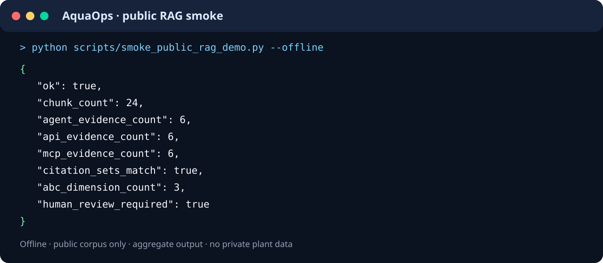
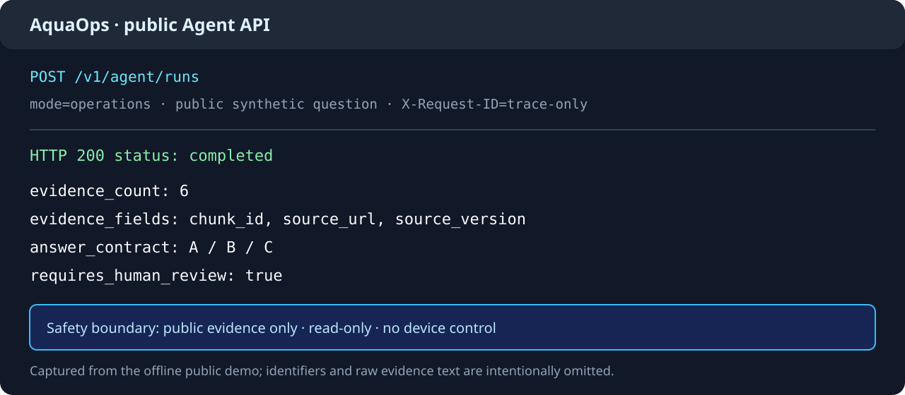

# AquaOps Copilot

> 面向水务运维场景的公开 Agent + RAG 演示项目。它把公开水务知识、可追溯检索、只读工具编排和安全输出契约组合成一个可复现的工程样例。

[](https://github.com/pj1433139082-hue/aquaops-copilot/actions/workflows/ci.yml)
[](LICENSE)

## 项目定位

AquaOps Copilot 是一个**决策支持**项目，不是生产控制系统。公开版本只使用公开授权的水务资料摘要和合成数据，不连接真实水厂，不控制现场设备，也不承诺生产可用性、准确率或安全认证。检索证据、版本和评分会随结果返回，所有运维判断都必须由人员复核。

公开版本重点展示四件事：

1. **可追溯 RAG**：来源注册、许可证校验、内容哈希、中文分块、混合召回、重排和引用闭环。
2. **安全 Agent**：Agent、HTTP API、MCP 共用只读检索与聚合能力，输出带有 ABC 完整性检查和人工复核标记。
3. **工程化后端**：FastAPI、PostgreSQL、Redis、Qdrant、Alembic 和 Celery 组成可本地运行的服务边界。
4. **可复现实验**：公开语料、评估集、命令、锁定依赖和镜像摘要都进入版本控制，便于复核而不是只展示截图。

## 公开演示

以下图片来自公开合成语料的离线 smoke/API 运行，只展示聚合字段和安全边界，不展示本机路径、模型路径、原始证据正文或任何私有水厂数据。可复现命令和测试报告是事实来源，图片只用于快速了解输出形态。





## 快速开始：60 秒合成回归

前置条件：Python 3.12 及以上、[uv](https://docs.astral.sh/uv/)；这组命令不需要 Docker、Qdrant、模型下载或水厂文件。

```powershell
uv run --locked python -m pytest tests\rag\test_public_corpus.py tests\rag\test_hybrid.py tests\rag\test_evaluation.py -q
```

如果希望执行完整公开测试：

```powershell
uv run --locked python -m pytest -q
```

## 真实公开 RAG 演示

真实演示使用固定 revision 的公开模型和公开语料。第一次执行准备命令需要联网下载模型；准备完成后，评估和 smoke 命令可以离线复用。模型缓存必须放在仓库之外，不能提交到 Git、staging、Docker build context 或截图。

```powershell
uv run --locked python scripts/prepare_public_rag_demo.py
uv run --locked python scripts/evaluate_public_rag_demo.py --offline
uv run --locked python scripts/smoke_public_rag_demo.py --offline
```

`--offline` 会在命令生命周期内禁止模型联网探测。命令只输出聚合结果或安全摘要；正常结果应包含公开分块/案例数量、语料与评估哈希、`abc_dimension_count=3`、`human_review_required=true` 和三入口引用集合一致等字段，不会回显查询正文、原始证据、本机模型路径或异常堆栈。

真实流程、固定模型 revision、评测口径和失败处理见[公开 RAG 真实演示](docs/public-rag-demo.md)与[公开 RAG 评估说明](docs/public-rag-evaluation.md)。

## RAG 与 Agent 结构

公开语料经过来源许可和哈希校验后进入统一注册表，再执行中文感知分块。召回阶段组合 BM25、向量检索和 RRF 融合；候选集可选 BGE reranker 或 OpenVINO 后端，最终返回带 `chunk_id`、`source_url`、`source_version` 和分数的证据集合。

Agent、HTTP API 和 MCP 不各自实现一套检索逻辑，而是复用同一公开检索核心：

- HTTP：`POST /v1/agent/runs` 提交运行，`GET /v1/agent/runs/{run_id}` 获取同一结果。
- Agent：根据 `operations` 或 `research` 模式执行固定安全图，结果必须包含答案、证据和人工复核状态。
- MCP：stdio 传输只暴露三个公开、只读、聚合型工具，不监听 HTTP 端口。
- 安全边界：当前公开服务没有写入、删除、控制或私有数据工具；公开 MCP 只允许注册的公开来源和安全字段。

详细设计见[公开架构说明](docs/public-architecture.md)、[公开 MCP 说明](docs/public-mcp.md)和[企业预测输出契约](docs/enterprise-forecast-output-contract.md)。

## 本地 API 与 Compose 服务

Docker Compose 用于启动本地 PostgreSQL、Redis、Qdrant、数据库迁移和 API。先复制环境模板，并在本机填写随机的数据库密码和至少 32 字符的 JWT 密钥；真实密钥只放在被 Git 忽略的 `.env`，不要写入仓库。

```powershell
Copy-Item .env.example .env
docker compose up --build -d
```

已有镜像时可以直接启动：

```powershell
docker compose up -d
```

检查 API：

```powershell
curl http://localhost:8000/health
curl http://localhost:8000/ready
```

停止服务：

```powershell
docker compose down
```

如需同时移除该 Compose 堆栈创建的命名卷和孤儿容器：

```powershell
docker compose down --volumes --remove-orphans
```

Qdrant 只在 Compose 内部网络可达，公开版本不得指向远程/生产 Qdrant。公开服务没有未认证的宿主机 Qdrant 端口，也不应挂载任何水厂原始目录。

### 可选模型 worker

默认 Compose 不下载模型。需要测试公开资料异步摄取时，显式启用 `model-worker` profile：

```powershell
docker compose --profile model-worker up --build -d
```

worker 使用独立的锁定依赖和命名模型缓存卷，只接受注册且哈希校验通过的公开语料。该 profile 不是生产部署方案，不得挂载私有数据或主机模型目录。

## 本地 stdio MCP

公开 MCP 不作为 Compose 服务，也不监听端口。需要 MCP 客户端连接时运行：

```powershell
uv run --locked python -m aquaops.mcp.public_server
```

可用工具为：

- `retrieve_public_water_knowledge`：检索公开水务知识并返回引用。
- `aggregate_public_history`：对公开历史窗口返回聚合统计。
- `screen_public_anomaly`：对公开指标窗口执行异常筛查。

工具输入会拒绝原始路径、SQL、命令、令牌、私有查询和未经许可的来源。威胁模型和固定错误格式见[公开 MCP 说明](docs/public-mcp.md)。

## 测试入口

只做公开 RAG 合成回归时：

```powershell
.venv\Scripts\python.exe -m pytest tests\rag\test_public_corpus.py tests\rag\test_hybrid.py tests\rag\test_evaluation.py -q
```

完整回归推荐使用锁定环境：

```powershell
uv run --locked python -m pytest -q
```

可选的 Qdrant 契约测试不会启动 Docker，只有显式设置两个开关并且目标是本机 Qdrant 时才运行：

```powershell
$env:AQUAOPS_RUN_QDRANT_CONTRACT = "1"
$env:AQUAOPS_QDRANT_CONTRACT_ALLOW_WRITE = "1"
.venv\Scripts\python.exe -m pytest tests\integration\test_qdrant_contract.py -q
```

该测试使用 UUID 临时集合和合成数据，并在 `finally` 中删除集合；不要对非本机或生产 Qdrant 开启。

## 运行结果与限制

`POST /v1/agent/runs` 在本地单进程模式下同步执行安全图并返回完成结果。运行结果保存在线程安全的进程内存中，最多保留 100 条，重启后丢失，也不支持多 worker 共享。因此它适合演示和接口契约测试，不是可靠任务队列；后续生产实现需要替换为持久化执行与结果存储。

当前版本的限制包括：公开语料是固定的 curated demo corpus，默认只演示单 worker；真实模型性能、延迟和可用性不构成生产 SLA；同一 Python 进程内的恶意插件隔离仍需独立的最小权限服务和人工审批。

## 镜像摘要与供应链记录

以下 tag 和 digest 于 2026-07-19 根据官方 Registry v2 manifest 元数据核验。tag 便于阅读，digest 用于固定构建所使用的镜像内容；审计测试保留固定短语 `digest fixes the image content`。

- Docker Hub Registry v2：`qdrant/qdrant:v1.18.2@sha256:75eab8c4ba42096724fdcfde8b4de0b5713d529dde32f285a1f86fdcb2c9e50c`
- Docker Hub Registry v2：`python:3.12-slim@sha256:57cd7c3a7a273101a6485ba99423ee568157882804b1124b4dd04266317710de`
- GitHub Container Registry v2：`ghcr.io/astral-sh/uv:0.5.30@sha256:bb74263127d6451222fe7f71b330edfb189ab1c98d7898df2401fbf4f272d9b9`

## 数据、许可证与安全

- 公开数据边界和来源登记：[数据来源说明](docs/public-data-sources.md)、[数据溯源记录](docs/data-provenance.md)。
- 许可证：AquaOps 源码采用 Apache-2.0，见 [LICENSE](LICENSE)。依赖和来源归属见 [docs/public-license-notices.md](docs/public-license-notices.md)。
- 安全问题：请按 [SECURITY.md](SECURITY.md) 的安全披露流程联系维护者，不要提交私有水厂数据、真实令牌或可利用的攻击样例。
- 发布检查：[发布检查清单](docs/release-checklist.md) 记录公开边界、依赖、测试和人工复核项目。

本仓库不包含真实水厂 CSV/XLS、生产工单、内部 URL、模型权重、访问令牌或本机路径。需要接入私有数据时，应在隔离的私有部署中单独设计权限、审计、记忆和人工审批边界，不能把私有资料复制到本公开仓库。
